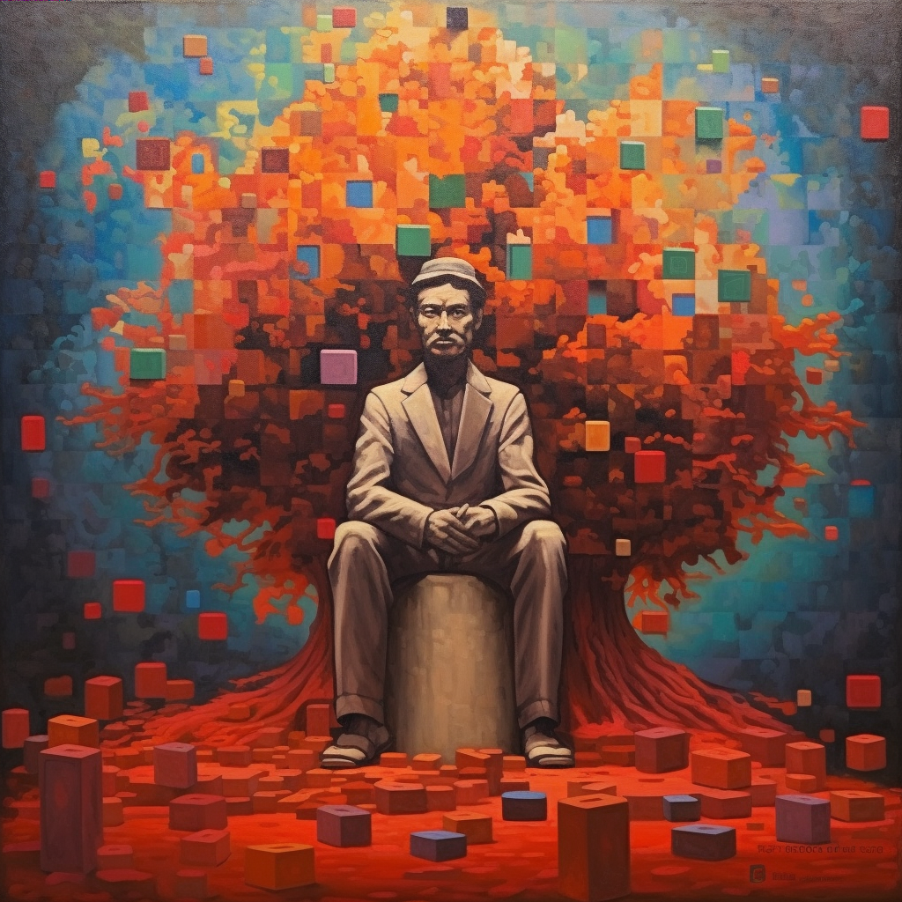

# 🗺️ bitmap 101

Welcome to Bitmap, a transmutational Metaverse standard tapping into the Bitcoin Blockchain. Leveraging the Ordinals theory and Bitmap theory, Bitmap offers a method to inscribe land claims unto consensual geospatial canvas real estate across the timechain tapestry known as Bitcoin. It's a new frontier in the world of decentralized digital ownership and a new understanding of Metaverse.

<figure><figcaption>
"Some inventions are more like discovery's" - <em>Bitoshi Blockamoto</em>
</figcaption></figure>

### What is Bitmap?

Bitmap is a consensus standard that allows anybody to claim the geospatial digital real estate of a Bitcoin Block. This process is achieved by being the first to inscribe _`{block-height}.bitmap`_ unto a Satoshi using the Ordinals Inscription standard. This process is equitable and decentralized, transmuting any Bitcoin Block into a part of the Metaverse at the cost of energy.

Platforms can parse these inscriptions, and the related Bitcoin Block data, into the 3D realm and grant access to block owners, creating a new paradigm for open-source development.

Bitmap Theory represents the mapping of Bitcoins data landscape to spatial analogues, bringing to light the base substrate of a persistent Metaverse. To own a piece of the Bitcoin Map known as Bitmap, one must own a valid District or Parcel land inscription.
