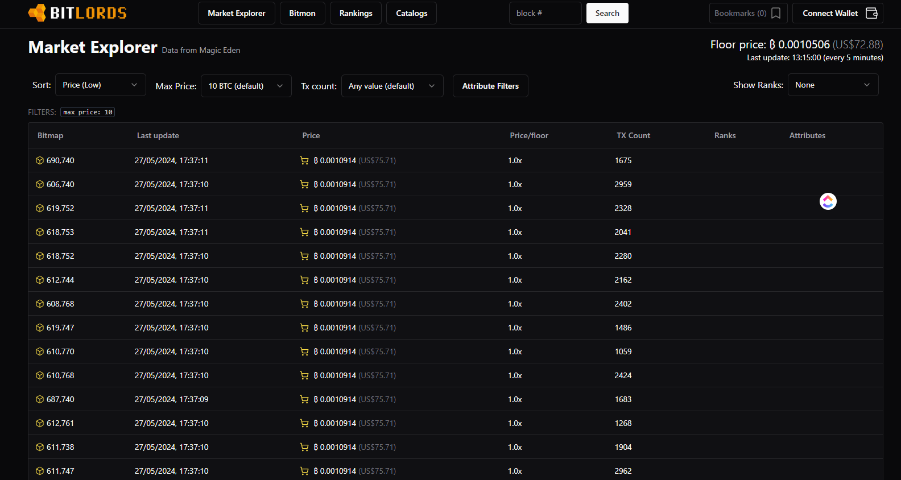

# 🥽 How to View Blocks

## CURRENT AVAILABLE TOOLS

Transaction block data can be visualized like this using a tool like BitFeed (see [Broken link](broken-reference "mention")).

.png>)

You can also use MemPool (see [Broken link](broken-reference "mention")) which uses a similar structure to visualize blocks.

## ROADMAP

We would like to fork these block visualizers (such as BitFeed) and build a world map this way.

The map would show which blocks (and parcels) are taken, which are available, similar to the Sandbox game and Voxels metaverse.

Minecraft map creation is generative based upon many random factors. Bitmap aims to build something akin to a generative world that is built upon Bitcoin as the base-readable mass value.

_**"THE BLOCKCHAIN IS THE HIGGS BOSON OF THE VIRTUAL REALM"**_

[.](./ "mention"):

Learn how to [how-to-claim-a-district.md](how-to-claim-a-district.md "mention")

Learn how to [how-to-search-blocks.md](how-to-search-blocks.md "mention")&#x20;

Learn how to [how-to-view-blocks.md](how-to-view-blocks.md "mention")
