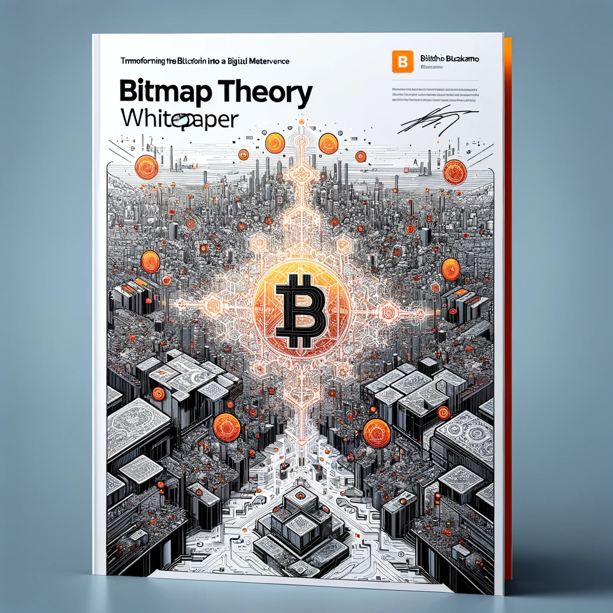

# 📃 bitmap theory whitepaper

<figure><figcaption>
<em>Cover created by BitmapperGPT (alpha).</em>
</figcaption></figure>

**Summary.** A spatial digital realm derived from the data and ruleset of Bitcoin amounts to a universal persistent virtual landscape which inherits the unique properties of Bitcoin. It takes advantage of data's unique ability to be parsed from multiple angels. This paper introduces the core vital components of Bitmap Theory which enable on-chain reading and writing Bitmap data on Ordinals.


Click through the links in **CONTENTS** to browse the Bitmap Theory living **whitepaper**.


## CONTENTS


[abstract.md](abstract.md)



[introduction.md](introduction.md)



[background.md](background.md)



[methodology.md](methodology.md)



[theory.md](theory.md)

