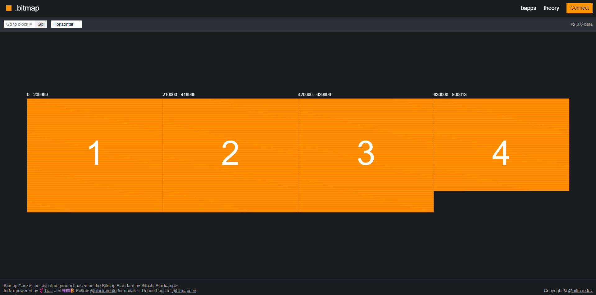

# 🟧 bitmap.land

## The Design



The Core Map is the signature map by [@blockamoto](https://twitter.com/blockamoto) and [@bitmapdev](https://twitter.com/bitmapdev).

<figure><figcaption></figcaption></figure>

This ongoing developing project is our way to express the standard at its core.

The platform is built to be extendible through the implementation of Bapps (Bitmap Apps).

Index powered by [Trac](https://trac.network/), an decentralized ordinals and bitmap core indexer.

**NEXT:** [#the-map-design](./#the-map-design "mention")



When you first enter bitmap.land, you are presented with our signature bitmap browser.

You notice it is split into the 4 halving epochs. These represent Bitcoin's lifecycle, so far.

You click, drag, scroll, switch, and search to navigate deeper to discover this maps secrets.

Zooming in, you notice difficulty adjustment periods are represented every 2016 districts.

Each square is a [district-theory.md](../../theory/district-theory.md "mention"). The number on the square represents the districts blockheight.

Once loaded, Orange squares represents verified districts which have been claimed.

If you are lucky enough to spot a grey block, it means this bitmap has not yet been claimed.

**NEXT:** [#navigating-the-map](./#navigating-the-map "mention")



🤚 Pan : click & drag | :telescope: Zoom : scroll in or out | :mag\_right: Search District | Inscribe districts

:window: Change view: horizontal/vertical | :point\_up\_2: Click Districts | :orange\_square: Parcel view | :pen\_fountain: Inscribe parcels

**NEXT:** [Broken link](broken-reference "mention")



