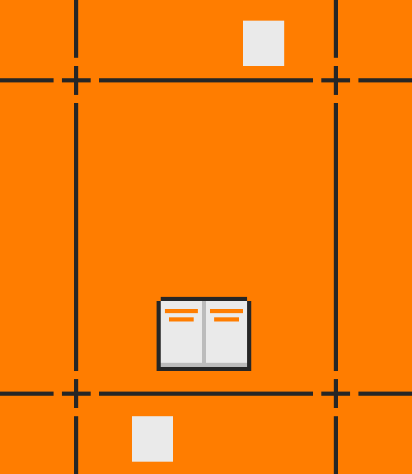

# 📄 Introduction

<figure><figcaption>
"Some inventions are more like discoveries" - <a href="https://twitter.com/blockamoto">Bitoshi Blockamoto</a>
</figcaption></figure>

Every ten minutes, on average, a new block of transaction data is born on the Bitcoin Blockchain. The data within this block represents the collective human and machine proof-of-work energy transferred between parties. Each block proves the work of the miners meeting the work of the users who transact in Bitcoin, capturing the energetic balance between human and machine. The data is generated by its cryptographic collaborative procedure, and spans the globe, forming a global collective memory of transactions.

The aim of Bitmap Theory is to map the dimensions of Bitcoin spatially, unveiling a unified Metaverse seed generated by its naturally high-permanence data structure. Typically procedural generation utilizes arbitrary data to create cohesive random worlds within a specified ruleset. In the example of Minecraft, the same seed will always result in the same world. However there is no singular world of Minecraft. Minecraft is a world generator.

Bitmap, on the other hand, proposes Bitcoin as the seed set of data which can be interpreted to generate a universal digital space. Due to the nature of Bitcoin, this would satisfy the true definition of Metaverse, which is typically defined as a theoretical persistent universe. The data underpinning this Bitmap universe lives on every single Full Bitcoin Node, maintained by the miners of Bitcoin who bring each block into existence like new stars being born.

The Theory enables reading and writing using the Bitmap standard, and across these interpretations we can form a base-level of truth, terraforming this map as a unified experience, regardless of platform. Whilst platforms may interpret the data in unique ways, the data itself is shared across all platforms. This allows all platforms to be referencing the same shared landscape when building. This creates a system whereby anything built with Bitmap Theory inherits the longevity of Bitcoin, and the robustness of Ordinals Theory.

This paper outlines the core theory & ruleset of Bitmap, and introduces new concepts proposed to satisfy both the reading and writing with Bitmap Theory at each level of resolution, and across all known dimensions of Bitcoin. Most notably, the ability to pin inscriptions to your Bitmap Districts and Parcels broadly, or to specific co-ordinates, will be proposed. This vital core component of Bitmap, which has been missing from the Standard up until this point, will enable the on-chain terraforming and building of the land. The ongoing provenance of changes made to the Bitmap landscape will be accessible through the ruleset defined in this paper, and maintained by Bitcoin.


This is the end of the **Introduction**. Come back on Tuesday for the **Background** section.


***


## READERS ALPHA: AVAILABLE SOON.

To celebrate the calm and orderly rollout of Bitmap Theory, the living whitepaper, we fused some things together and gave birth to an actual **living whitepaper**! Made using the brc420 standard. Now you can finally live your dreams and step into the body of white paper.

### STAY TUNED

_Created by_ [_@6elatin_](https://twitter.com/6elatin) _and_ [_@Blockamoto_](https://twitter.com/blockamoto)_._


